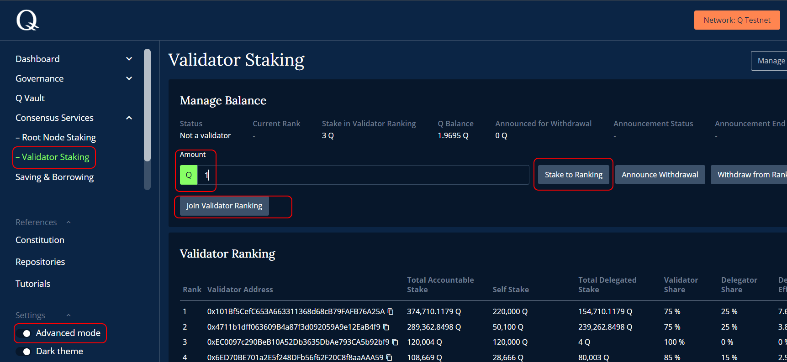
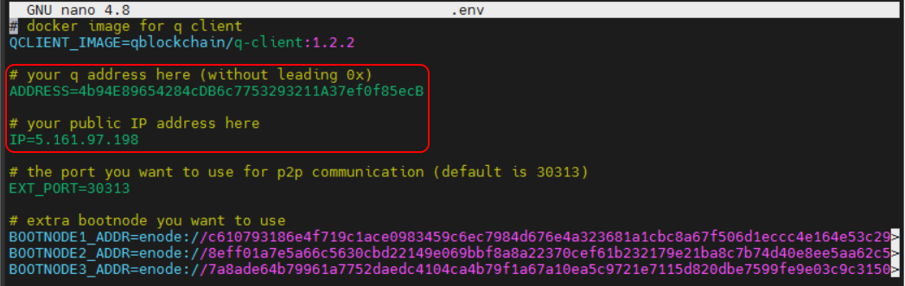
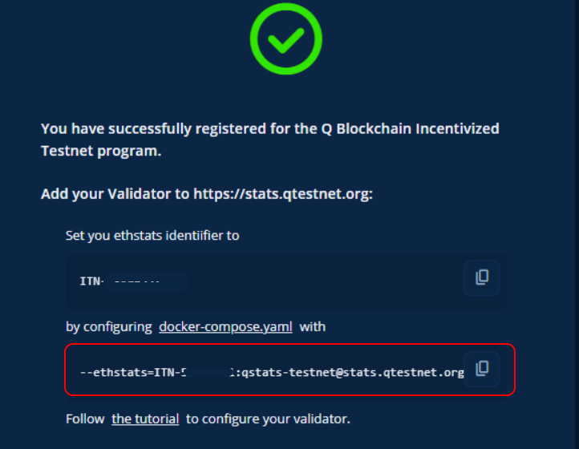

# Q2

<details><summary>Official links</summary>
  
- Website - [https://q.org/](https://q.org/)
- Mainnet - [https://hq.q.org/](https://hq.q.org/)
- Testnet - [https://hq.qtestnet.org/](https://hq.qtestnet.org/)
- ChainList - [https://chainlist.org/chain/35441](https://chainlist.org/chain/35441)
- Medium - [https://medium.com/q-blockchain](https://medium.com/q-blockchain)
- Reddit - [https://www.reddit.com/r/QBlockchain/](https://www.reddit.com/r/QBlockchain/)
- Twitter - [https://twitter.com/QBlockchain](https://twitter.com/QBlockchain)
  
</details>

- Constitution & Whitepaper
  
    • Constitution - [https://q.org/assets/files/Q_Constitution.pdf](https://q.org/assets/files/Q_Constitution.pdf)
    
    • Whitepaper - [https://q.org/assets/files/Q Whitepaper_v1.0.pdf](https://q.org/assets/files/Q%20Whitepaper_v1.0.pdf)
    
- Faucet
  
    • [https://faucet.qtestnet.org/](https://faucet.qtestnet.org/)
    
- Documentation
  
    • Documentation - [https://docs.q.org/](https://docs.q.org/)
    
    • Source Code - [https://gitlab.com/q-dev](https://gitlab.com/q-dev)
    
    • Security Audit - [https://medium.com/q-blockchain/q-system-contracts-security-audit-e101ea356586](https://medium.com/q-blockchain/q-system-contracts-security-audit-e101ea356586)
    
- Explorer
  
    • [https://explorer.qtestnet.org/](https://explorer.qtestnet.org/) 
    
    • [https://stats.qtestnet.org/](https://stats.qtestnet.org/)
    
    • [https://explorer.qtestnet.org/graphiql](https://explorer.qtestnet.org/graphiql)
    
- Official guide
  
    • [https://docs.qtestnet.org/how-to-setup-validator/](https://docs.qtestnet.org/how-to-setup-validator/)

- Guide
    - Подготовка сервера при необходимости
      
        ```bash
        # обновление 
        apt update && apt upgrade -y
        
        # установка необходимых утилит
        apt install curl iptables build-essential git wget jq make gcc nano tmux htop nvme-cli pkg-config libssl-dev libleveldb-dev tar clang bsdmainutils ncdu unzip libleveldb-dev -y
        
        # установка docker одной строкой
        . <(wget -qO- https://raw.githubusercontent.com/SecorD0/utils/main/installers/docker.sh)
        
        # обновление docker-copmose до v2.5.0
        apt purge docker-compose -y
        curl -L https://github.com/docker/compose/releases/download/v2.5.0/docker-compose-linux-x86_64 -o /usr/local/bin/docker-compose
        chmod +x /usr/local/bin/docker-compose
        ln -s /usr/local/bin/docker-compose /usr/bin/docker-compose
        ```
        
    
    ### Начало
    
    ✅Клонируем репозиторий и переходим в каталог /testnet-validator
    
    ```bash
    git clone https://gitlab.com/q-dev/testnet-public-tools 
    cd testnet-public-tools/testnet-validator
    ```
    
    ✅Далее, создаем текстовый файл pwd.txt с паролем который находится в каталоге `testnet-public-tools/testnet-validator/keystore/`
    
    ```bash
    cd $HOME/testnet-public-tools/testnet-validator/
    mkdir keystore
    cd keystore
    nano pwd.txt
    # придумываем пароль и вписываем, не забудьте его сохранить (без кавычек) 
    # далее закрываем nano 
    Ctrl+o enter Ctrl+x
    ```
    
    ### **Generate a Keypair for Validator**
    
    ✅Создается `.json` файл кошелька который находится в каталоге `/root/testnet-public-tools/testnet-validator/keystore/` - даный ключ экспортируем в `Metamask` , так же данный кошелек нужно указать в форме. Пароль от этого кошелька записан в `pwd.txt` .
    
    ```bash
    cd $HOME/testnet-public-tools/testnet-validator/
    docker-compose run --rm --entrypoint "geth account new --datadir=/data --password=/data/keystore/pwd.txt" testnet-validator-node
    # вывод:
    # Your new key was generated
    
    # Public address of the key:   0xb3FF24F818b0ff6Cc50de951bcB8f86b52287dac
    # Path of the secret key file: /data/keystore/UTC--2021-01-18T11-36-28.705754426Z--b3ff24f818b0ff6cc50de951bcb8f86b52287dac
    
    # - You can share your public address with anyone. Others need it to interact with you.
    # - You must NEVER share the secret key with anyone! The key controls access to your funds!
    # - You must BACKUP your key file! Without the key, it's impossible to access account funds!
    # - You must REMEMBER your password! Without the password, it's impossible to decrypt the key!
    ```
    
    <aside>
    💡 Не забываем сохранять пароли и Ключи (UTC--…)
    </aside>
    
    ✅Нужно 2 кошелька эфириум - для ревардов и тестовый, для удобства добавляем в основной кошелек Метамаск наш тестовый сгененрированный кошелек. 
    
    ✅Для этого в `Metamask` `Импортировать счет` Выбрать тип `Файл JSON` 
    
    ✅Выбираем Ключ из каталога `.../keystore` `example: UTC--2021-01-18T11-36-28.705754426Z--b3ff24f818b0ff6cc50de951bcb8f86b52287dac` 
    
    ✅ Вводим пароль (`pwd.txt`)
    
    ✅Ждем минут 10
    
    ### **Создаем валидатора**
    
    ✅Переходим на сайт [`https://hq.qtestnet.org/`](https://hq.qtestnet.org/), коннектим тестовый кошелек`Connect to Q Testnet` 
    
    ✅Включаем `Advanced mode`, переходим в `Validator Staiking`, вводим количество `Amount` и стейкаем `Stake to Ranking`, после чего присоединяемся `Join Validator Ranking`   
    
    ✅Монеты получаем из крана -  [Faucet](https://faucet.qtestnet.org/)
    
    
    
    ### **Configure Setup**
    
    ✅ Редактируем файл `.env` 
    
    ```bash
    cd $HOME/testnet-public-tools/testnet-validator/
    nano .env
    
    # сохранить и закрыть nano Ctrl+o enter Ctrl+x
    ```
    
    в строчку `ADDRESS=`вставляем ваш адрес без 0x
    в строчку `IP=` вставляем ваш ip
    
    
    
    ✅ Редактируем файл `config.json`
    
    ```bash
    cd $HOME/testnet-public-tools/testnet-validator/
    nano config.json
    
    # сохранить и закрыть nano Ctrl+o enter Ctrl+x
    ```
    
    в строчку `"address":` в кавычки вставляем ваш адрес без 0x
    в строчку `"password":` в кавычки вставляем ваш пароль который вписывали в `pwd.txt`
    
    ### Регистрируем валидатора
    
    ✅ Заполняем форму - [https://itn.qdev.li/](https://itn.qdev.li/)
    
    ✅ Записываем Имя валидатора - его нужно будет вставить в `docker-compose.yaml`
    
    
    
    ✅ Редактируем файл `docker-compose.yaml` 
    
    ```bash
    cd $HOME/testnet-public-tools/testnet-validator/
    nano docker-compose.yaml
    ```
    
    ✅ Удаляем всё (удалить строчку целиком `Ctrl+k` ). Вставляем как ниже и изменяем Имя валдатора на свое в строке `"--ethstats=`
    
    ```bash
    version: "3"
    
    services:
      testnet-validator-node:
        image: $QCLIENT_IMAGE
        entrypoint: [
          "geth",
          "--testnet",
          "--datadir=/data",
          "--syncmode=full",
          "--ethstats=<ИМЯ_ВАЛИДАТОРА>:qstats-testnet@stats.qtestnet.org",
          "--whitelist=3699041=0xabbe19ba455511260381aaa7aa606b2fec2de762b9591433bbb379894aba55c1",
          "--bootnodes=$BOOTNODE1_ADDR,$BOOTNODE2_ADDR,$BOOTNODE3_ADDR",
          "--verbosity=3",
          "--nat=extip:$IP",
          "--port=$EXT_PORT",
          "--unlock=$ADDRESS",
          "--password=/data/keystore/pwd.txt",
          "--mine",
          "--miner.threads=1",
          "--miner.gasprice=1",
          "--rpc.allow-unprotected-txs"
        ]
        volumes:
          - ./keystore:/data/keystore
          - ./additional:/data/additional
          - testnet-validator-node-data:/data
        ports:
          - $EXT_PORT:$EXT_PORT
          - $EXT_PORT:$EXT_PORT/udp
        restart: unless-stopped
    
    volumes:
      testnet-validator-node-data:
    
    # сохранить и закрыть nano Ctrl+o enter Ctrl+x
    ```
    
    ### Запускаем ноду
    
    ```bash
    cd $HOME/testnet-public-tools/testnet-validator/
    docker-compose up -d
    ```
    
    Посмотреть логи 
    
    ```bash
    docker-compose logs -f --tail "100"
    ```
    
    ### Обязательное обновление - выполнить сразу после запуска ноды
    
    На блоке **3,699,041**  сеть перестает синхронизацию, поэтому чтобы его “проскачить” в  консоле необходимо ввести команду ниже и перезагрузить ноду с сбросом базы 
    
    ```bash
    cd $HOME/testnet-public-tools/testnet-validator/
    
    # переходим в консоль
    docker-compose exec testnet-validator-node geth attach /data/geth.ipc
    
    # вводим команду
    debug.setHead(web3.toHex(3699040))
    
    # закрыть консоль: ctrl+d или exit 
    
    # перезагружаем ноду
    docker-compose down -v && docker-compose up -d
    ```
